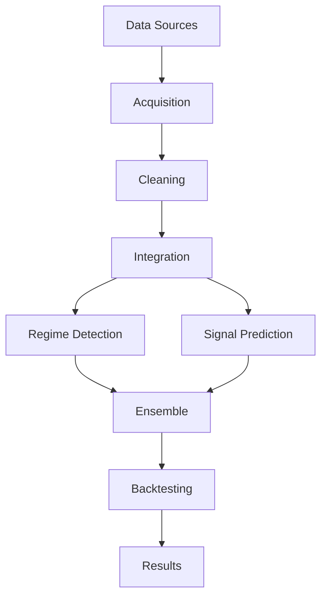

# Hybrid Crypto Trading Model Pipeline

## Overview

This project implements a hybrid trading strategy for Bitcoin, combining multi-source data, advanced feature engineering, regime-aware modeling, and robust backtesting. The system is modular, extensible, and designed for both research and practical experimentation.

---

## System Architecture & Data Flow

**High-Level Workflow:**

1. **Data Acquisition:** Fetches historical data from multiple APIs (CryptoQuant, Glassnode, Coinglass, Bybit, Binance) and sentiment sources. Data is cached for efficiency.
2. **Data Cleaning & Feature Engineering:** Cleans, aligns, and engineers features (technical, statistical, sentiment) for each dataset.
3. **Data Integration:** Merges all features on a common datetime index, handling missing data and generating synthetic features as needed.
4. **Regime Detection:** Trains a Hidden Markov Model (HMM) to classify market regimes (Bull, Bear, Sideways) using engineered features.
5. **Signal Prediction:** Trains an LSTM neural network to predict price movement signals, using both financial and sentiment features.
6. **Ensemble Logic:** Combines HMM regime and LSTM signal, applying regime-based filtering and signal thresholding.
7. **Backtesting & Evaluation:** Runs a comprehensive backtest, computes performance metrics, and generates visualizations.

**Data Flow:**

- `main.py` orchestrates the pipeline, calling functions from `models/model_training.py` (for HMM/LSTM/ensemble), `backtest/backtesting.py` (for evaluation), and `utils/config.py` (for configuration).
- Data moves from raw acquisition → cleaning/feature engineering → merged dataset → modeling → signal generation → backtesting → results/visualization.

**Key Decision Points:**

- **Caching vs. Fresh Data:** Controlled by `USE_CACHE` in `main.py`.
- **Handling Missing Data:** Synthetic features and imputation logic in feature engineering.
- **Model Training:** Choice of HMM/LSTM parameters, feature selection, and training window.
- **Ensemble Signal Logic:** Regime-based filtering and signal thresholding.
- **Backtesting Parameters:** Position sizing, risk management, and evaluation metrics.

---

## System Architecture Diagram

> The following diagram uses [Mermaid](https://mermaid-js.github.io/mermaid/) syntax. It will render in supported Markdown viewers (e.g., GitHub, VSCode with Mermaid plugin).



**Legend:**

- **Data Sources:** CryptoQuant, Glassnode, Coinglass, Bybit, Binance, Sentiment
- **Acquisition:** Data fetching and caching (main.py, utils/config.py)
- **Cleaning:** Data cleaning and feature engineering (main.py, data/)
- **Integration:** Merging and synthetic features (main.py)
- **Regime Detection:** HMM model (models/model_training.py)
- **Signal Prediction:** LSTM model (models/model_training.py)
- **Ensemble:** Combines regime and signal (models/model_training.py)
- **Backtesting:** Evaluation and metrics (backtest/backtesting.py)
- **Results:** Visualizations and output metrics

---

## Pipeline Architecture

### 1. Data Acquisition & Integration

- **Code:** `main.py`, `utils/config.py`
- **Sources:** CryptoQuant, Glassnode, Coinglass, Bybit, Binance, and a HuggingFace sentiment dataset.
- **Sentiment:** Aggregated from news, Reddit, and other sources, with both numeric (`action_score`) and categorical (`sentiment_class`) sentiment features.
- **Caching:** All raw data is cached locally for efficient re-use (`load_from_cache`, `save_to_cache`).

### 2. Data Cleaning & Feature Engineering

- **Code:** `main.py`, `data/`
- **Cleaning:** Handles missing values, outliers, and aligns all data on a common datetime index (`clean_onchain_data`).
- **Feature Engineering:** Technical indicators (RSI, Bollinger Bands, MACD), rolling statistics, volatility, sentiment features, regime label (from HMM) as a feature for LSTM (`feature_engineering`).
- **Imputation:** Forward-fills missing Coinglass and other features.

### 3. Data Integration & Synthetic Features

- **Code:** `main.py`
- **Merging:** Aligns and merges all features on a common datetime range (`align_and_merge_datasets`).
- **Synthetic Features:** Generates features to compensate for missing data (`create_synthetic_features`).

### 4. Regime Detection (HMM)

- **Code:** `models/model_training.py`
- **Model:** Gaussian HMM (`train_improved_hmm_regime_detector`) with robust settings.
- **Features:** Financial and sentiment features (excluding categorical sentiment).
- **Output:** Assigns a regime label (0=Sideways, 1=Bull, 2=Bear) to each time step.

### 5. Signal Prediction (LSTM)

- **Code:** `models/model_training.py`
- **Model:** LSTM neural network (`train_enhanced_lstm_signal_predictor`) with bidirectional layers, dropout, and regularization.
- **Feature Selection:** Uses `SelectKBest` for top features.
- **Training:** Keras `Sequence` data generator for memory efficiency.

### 6. Ensemble & Signal Logic

- **Code:** `models/model_training.py`
- **Ensemble:** Combines HMM regime and LSTM signal (`predict_with_ensemble`).
- **Regime Filtering:** Only takes long signals in bull regime, short in bear regime, holds in sideways regime.
- **Signal Thresholding:** Optional thresholding on LSTM predictions.

### 7. Backtesting & Evaluation

- **Code:** `backtest/backtesting.py`
- **Metrics:** Sharpe Ratio, Max Drawdown, Trade Frequency, Win/Loss Ratio, Total Trades, Win Rate, Average Win/Loss, Profit Factor (`backtest_and_evaluate`).
- **Visualization:** Static (PNG) and interactive (HTML) equity curve and drawdown charts (`plot_equity_curve`, `plot_interactive_equity_curve`).
- **Diagnostics:** Prints detailed trade statistics.

---

## Key Decision Points & Logic

- **Data Caching:** Controlled by `USE_CACHE` in `main.py`.
- **Data Imputation & Synthetic Features:** Handled in feature engineering and merging steps.
- **Model Training:** HMM and LSTM training parameters and feature selection are set in `models/model_training.py`.
- **Ensemble Signal Logic:** Regime-based filtering and signal thresholding in `predict_with_ensemble`.
- **Backtesting:** Position sizing, risk management, and evaluation metrics in `backtest/backtesting.py`.

---

## Current Results

**Latest Backtest Results:**

- **Sharpe Ratio:** 0.91 (Target: ≥ 1.8)
- **Max Drawdown:** -5.86% (Target: ≥ -40%)
- **Trade Frequency:** 15.60% (Target: ≥ 3%)
- **Win/Loss Ratio:** 1.02 (Target: > 1.0)
- **Total Trades:** 13,669
- **Win Rate:** 50.53%
- **Average Win:** 0.05%
- **Average Loss:** -0.05%
- **Profit Factor:** 1.04
- **Meets All Criteria:** **NO**

**Interpretation:**

- The strategy is active (high trade frequency) and risk-managed (low drawdown), but the Sharpe Ratio is below target, and the profit factor is only slightly above 1, suggesting marginal profitability and possible overfitting.
- The model is not yet robust enough for live trading, but the pipeline is well-structured for further research and tuning.

---

## Recommendations for Further Improvement

### Advanced NLP & Sentiment Integration

- **Multi-source Sentiment:** Integrate real-time sentiment from crypto news APIs, Twitter, Reddit, and on-chain data (e.g., whale alerts).
- **Contextual NLP:** Use transformer models (FinBERT, CryptoBERT) to extract event types and sentiment polarity.
- **Event Detection:** Flag major news events and use as features or regime triggers.
- **Sentiment Regimes:** Train a separate HMM on sentiment features to detect "sentiment regimes" and use as meta-features.
- **Temporal Sentiment Dynamics:** Use rolling sentiment volatility, momentum, or lagged sentiment features.

### Model Tuning & Robustness

- **Feature Selection:** Further refine features for both HMM and LSTM to reduce noise and overfitting.
- **Hyperparameter Tuning:** Systematically tune HMM states, LSTM architecture, and signal thresholds.
- **Walk-forward Validation:** Use rolling or walk-forward validation to ensure robustness across market regimes.

---

## How to Run

1. **Install dependencies:**
   ```bash
   pip install -r requirements.txt
   ```
2. **Prepare your `.env` file:**
   Add your API keys for CryptoQuant, Glassnode, Coinglass, Bybit, and Binance. Example:
   ```
   CRYPTOQUANT_API_KEY=your_key
   ```
3. **Run the pipeline:**

   ```bash
   python main.py
   ```

   - The script will fetch and cache data, process features, train models, generate signals, and run backtests.
   - Output metrics and visualizations will be saved in the project directory.

4. **Review results:**
   - Open `equity_curve.png` and `equity_curve_interactive.html` for visual analysis.
   - Check the console for detailed metrics and diagnostics.

**Troubleshooting:**

- If you encounter API errors, check your `.env` file and network connection.
- For memory issues, reduce the time window or batch size in LSTM training.
- To force fresh data download, set `USE_CACHE = False` in `main.py`.

---

## Developer Notes & Extensibility

- **Adding New Data Sources:**

  - Implement new fetchers in `main.py` or a new module in `data/`.
  - Add cleaning and feature engineering logic for the new source.
  - Update merging logic in `main.py` to include new features.

- **Extending Models:**

  - Add or modify model training functions in `models/model_training.py`.
  - Update the ensemble logic as needed.
  - For new regime detection or signal models, follow the HMM/LSTM function templates.

- **Custom Backtesting or Metrics:**

  - Add new evaluation functions in `backtest/backtesting.py`.
  - Update `backtest_and_evaluate` to include new metrics or risk management logic.

- **Configuration:**

  - Use `utils/config.py` for API key management and data directory paths.

- **Debugging:**

  - Use print statements or logging in `main.py` to trace data flow and model outputs.
  - Intermediate dataframes and model artifacts can be saved for inspection.

- **Reproducibility:**
  - The pipeline is modular; you can run individual steps or swap out components for experimentation.

---

## File Structure

- `main.py` — Pipeline entry point
- `data/` — Data acquisition, cleaning, feature engineering, sentiment integration
- `models/` — HMM and LSTM model training, ensemble logic
- `backtest/` — Backtesting, evaluation, and visualization
- `requirements.txt` — Dependencies
- `README.md` — This documentation

---

## Conclusion

The current pipeline is a robust foundation for hybrid crypto trading research, with modular data integration, advanced feature engineering, regime-aware modeling, and comprehensive backtesting. Further improvements in NLP-driven sentiment analysis and model tuning are recommended to achieve production-level performance.
